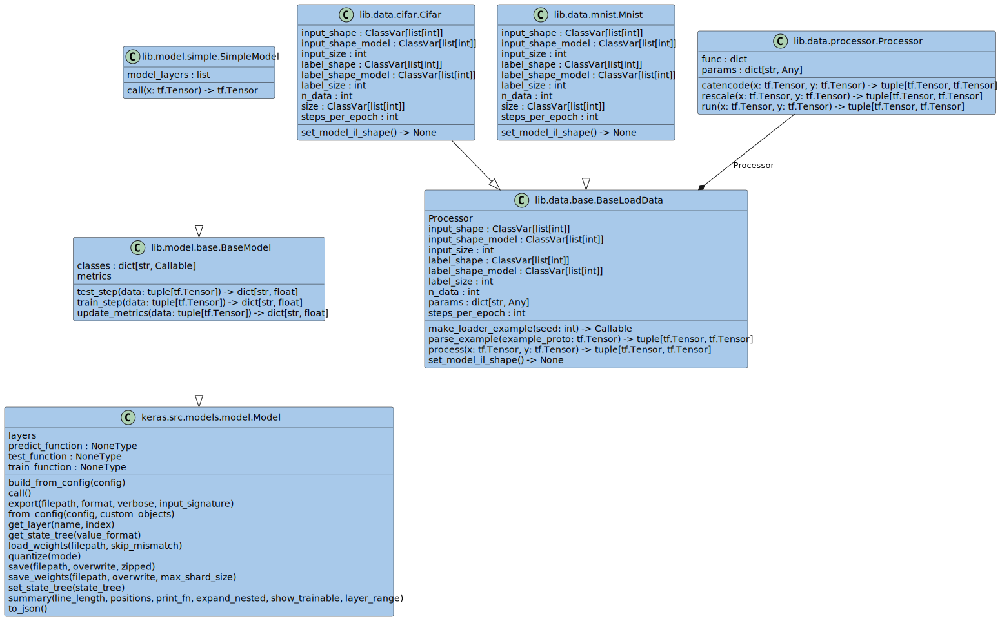

<!-- ============================================================
  Project Image
 ============================================================ -->
<!-- <div align=center>
  
</div> -->

<!-- ============================================================
  Overview
 ============================================================ -->

# :book:Overview

[](./README.md)
[](./README_JA.md)
[](./LICENSE)
[](https://mypy-lang.org/)
[](https://github.com/astral-sh/ruff)
[](https://github.com/astral-sh/uv)

[](https://github.com/python)
[](https://github.com/sphinx-doc/sphinx)
[](https://github.com/pytest-dev/pytest)
[](https://github.com/pydantic/pydantic)
[](https://github.com/numpy/numpy)
[](https://github.com/pandas-dev/pandas)
[](https://github.com/scipy/scipy)
[](https://github.com/scikit-learn/scikit-learn)
[](https://github.com/keras-team/keras)
[](https://github.com/tensorflow/tensorflow)

本リポジトリでは、tensorflow のテンプレートを定義しています。

パラメータファイルを使用して次の項目を設定することで、様々な組み合わせで学習と評価ができます。
また他の設定をそれぞれの設定クラスに実装することで簡単に使用できます。

- データ (とデータ前処理)
- モデル (とモデルレイヤー)
- 最適化手法
- 誤差関数
- メトリクス
- コールバック

実装されているソースは、Sphinx を使用してドキュメントを作成しています。

本リポジトリをクローンして、ローカルで確認してみてください。

ビルドの詳細については[こちら](docs/sphinx_docs.md)。

```bash
cd tensorflow-template/docs
make html -e SPHINXOPTS='-a -E -D language="en"' # "en" or "ja"
```

<!-- ============================================================
  Features
 ============================================================ -->
<!-- ## :desktop_computer:Features -->

<!-- ============================================================
  Usage
 ============================================================ -->

## :keyboard:Usage

### Install

```bash
git clone https://github.com/r-dev95/tensorflow-template.git
```

### Build virtual environment

`uv`がインストールされていることが前提です。

python の開発環境がまだ整っていない方は、[こちら][python]。

[python]: https://github.com/r-dev95/env-python

```bash
cd tensorflow-template
uv sync
```

### データのダウンロードと tfrecord データの作成

```bash
cd src
uv run python dataset.py --result dataset --data mnist
```

### モデルの学習

```bash
uv run python train.py --param param/tutorial/param_train.yaml
```

### モデルの評価

```bash
uv run python eval.py --param param/tutorial/param_eval.yaml
```

## パラメータファイルの使い方

パラメータファイル(`.yaml`)の使い方について説明します。

パラメータファイルは次のソースコードで使用します。
次のソースコードは一部コマンドライン引数を使用できますが、パラメータファイルで上書きできるため、パラメータファイルにすべてのパラメータを設定する前提です。

- train.py
- eval.py

一部設定はパラメータファイルを使用して設定できません。特に tensorflow (keras)の詳細な設定は公式サイトを参照し実装する必要があります。

### 主要なパラメータの設定

コマンドライン引数として実装されている主要なパラメータは、ゼロインデントで設定します。

- 主要なパラメータには`param`を含みますが、コマンドライン引数としてのみ機能するため設定しません。

`train.py`と`eval.py`の共通設定の例:

```yaml
# log handler (idx=0: stream handler, idx=1: file handler)
# (True: set handler, False: not set handler)
# type: list[bool, bool]
handler: [True, True]
# log level (idx=0: stream handler, idx=1: file handler)
# (DEBUG: 10, INFO: 20, WARNING: 30, ERROR: 40, CRITICAL: 50)
# type: list[int, int]
level: [10, 10]
# flag (eager mode: true, graph mode: false)
# type: boolean
eager: false
# random seed
# type: int
seed: 0
# directory path (data save)
# type: str
result: result
```

`train.py`のみの設定の例:

```yaml
# directory path (training data)
# type: str
train: data/mnist/train
# directory path (validation data)
# type: str | None
valid: data/mnist/test
# batch size (training data)
# type: int
train_batch: 32
# batch size (validation data)
# type: int | None
valid_batch: 1000
# shuffle size
# type: int | None
shuffle: null
# Number of epochs
# type: int
epochs: 2
```

`eval.py`のみの設定の例:

```yaml
# directory path (evaluation data)
# type: str
eval: data/mnist/test
# batch size (training data)
# type: int
batch: 1000
```

### `データ`と`データ前処理`のパラメータの設定

現在使用可能な`データ`は、`SetupData`クラスの`func`のキーを[参照](tensorflow_template/lib/data/setup.py)。

`データ`の設定の例:

```yaml
data:
  kind: mnist
```

現在使用可能な`データ前処理`は、`Processor`クラスの`func`のキーを[参照](tensorflow_template/lib/data/processor.py)。

- `データ前処理`の`kind`は、リストとして設定する。

- `kind`に`catencode`を設定する場合、`catencode`の設定は次の例のように設定する。
  以降のパラメータについても同様である。

`データ前処理`の設定の例:

```yaml
process:
  kind: [catencode, rescale]

  catencode:
    num_tokens: &num_classes 10
    output_mode: one_hot
    sparse: false

  rescale:
    scale: 0.00392156862745098
    offset: 0
```

### `モデル`と`モデルレイヤー`のパラメータの設定

現在使用可能な`モデル`は、`SetupModel`クラスの`func`のキーを[参照](tensorflow_template/lib/model/setup.py)。

`モデル`の設定の例:

```yaml
model:
  kind: simple
```

現在使用可能な`モデルレイヤー`は、`SetupLayer`クラスの`func`のキーを[参照](tensorflow_template/lib/model/layer.py)。

- `モデルレイヤー`の`kind`は、リストとして設定する。

- `kind`の値は、末尾に"\_" + 英数字をつけられる。

`モデルレイヤー`の設定の例:

```yaml
layer:
  kind: [flatten, dense_1, relu, dense_2]

  flatten:
    data_format: channels_last

  DENSE: &DENSE
    units: null
    activation: null
    use_bias: true
    kernel_initializer: glorot_uniform
    bias_initializer: zeros
    kernel_regularizer: null
    bias_regularizer: null
    activity_regularizer: null
    kernel_constraint: null
    bias_constraint: null
    lora_rank: null
  dense_1:
    <<: *DENSE
    units: 100
  dense_2:
    <<: *DENSE
    units: *num_classes

  relu:
    max_value: null
    negative_slope: 0
    threshold: 0
```

### `最適化手法`のパラメータの設定

現在使用可能な`最適化手法`は、`SetupOpt`クラスの`func`のキーを[参照](tensorflow_template/lib/optimizer/setup.py)。

- `最適化手法`のパラメータは、`train.py`でのみ使用する。

`最適化手法`の設定の例

```yaml
opt:
  kind: adam

  adam:
    learning_rate: 0.001
    beta_1: 0.9
    beta_2: 0.999
    epsilon: 0.0000001
    amsgrad: false
    weight_decay: null
    clipnorm: null
    clipvalue: null
    global_clipnorm: null
    use_ema: false
    ema_momentum: 0.99
    ema_overwrite_frequency: null
    loss_scale_factor: null
    gradient_accumulation_steps: null
    name: adam
```

### `誤差関数`のパラメータの設定

現在使用可能な`誤差関数`は、`SetupLoss`クラスの`func`のキーを[参照](tensorflow_template/lib/loss/setup.py)。

`誤差関数`の設定の例:

```yaml
loss:
  kind: cce

  cce:
    from_logits: true
    label_smoothing: 0
    axis: -1
    reduction: sum_over_batch_size
    name: categorical_crossentropy
    # dtype: null
```

### `メトリクス`のパラメータの設定

現在使用可能な`メトリクス`は、`SetupMetrics`クラスの`func`のキーを[参照](tensorflow_template/lib/metrics/setup.py)。

- `メトリクス`の`kind`は、リストとして設定する。

`メトリクス`の設定の例:

```yaml
metrics:
  kind: [mse, cacc]

  mse:
    name: mean_squared_error
    # dtype: null

  cacc:
    name: categorical_accuracy
    # dtype: null
```

### `コールバック`のパラメータの設定

現在使用可能な`コールバック`は、`SetupCallbacks`クラスの`func`のキーを[参照](tensorflow_template/lib/callbacks/setup.py)。

- `コールバック`のパラメータは、`train.py`でのみ使用する。

- `コールバック`の`kind`は、リストとして設定する。

`コールバック`の設定の例:

```yaml
cb:
  kind: [mcp, csv]

  mcp:
    # filepath: null            # The "filepath" is fixed in the code.
    monitor: val_loss
    verbose: 0
    save_best_only: false
    save_weights_only: true
    mode: auto
    save_freq: epoch
    initial_value_threshold: null

  csv:
    # filename: null            # The "filename" is fixed in the code.
    separator: ","
    append: false
```

<!-- ============================================================
  Structure
 ============================================================ -->

## :bookmark_tabs:Structure

<div align=center>
  
</div>

<!-- ============================================================
  License
 ============================================================ -->

## :key:License

本リポジトリは、[Apache License 2.0](LICENSE)に基づいてライセンスされています。
